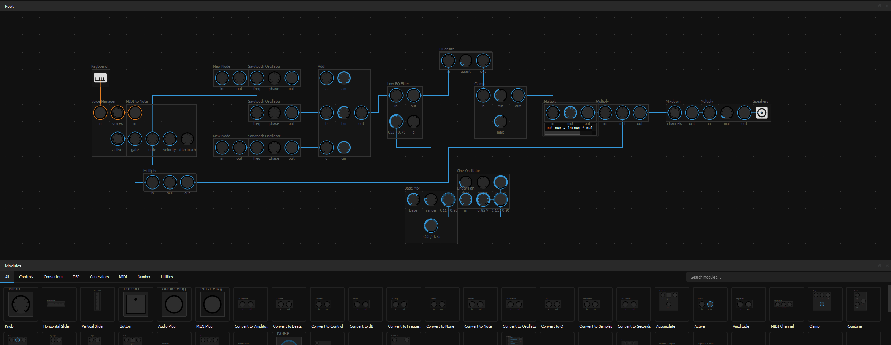

# Axiom

Axiom is a node-based realtime synthesizer, designed for size-constrained environments such as PC intros in the demoscene. It is currently developed by MONAD, but is entirely open source -- feel free to use and contribute!

Features:

 - Musician-friendly (ie knobs and sliders) interface
 - Highly customizable and flexible through a node editor and custom scripting language, named Maxim
 - Export to replayer with no dependencies (not even the standard library)
 - Use any DAW with VSTi support for note editing and automation

**Axiom is currently in very early development, and so no prepackaged versions are available.** Feel free to contribute issues, features, and pull requests though!

## Building

*Coming soon!*

## Usage Guide

*Coming soon!*

## Development

Axiom is comprised of several components:

 - The VST Editor, written with Qt and the VST SDK. This is the only part the user directly interacts with, and must be
   OS-independent.
 - The Maxim language compiler and runtime, written with LLVM and statically linked into the editor.
 - The replayer, written in size-optimised C++. Due to it's reliance on Maxim snippets, this must be compiled with
   Clang. The replayer provides a function to fill a buffer, use with the API of your choice.

## License

Licensed under the MIT license. See the LICENSE file in the repository for more details.
